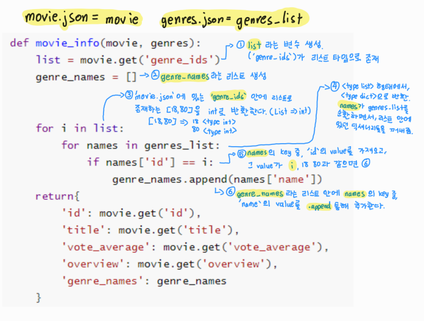

# 📋 Project 1

[00. 텍스트 데이터 출력 (연습)](#00-텍스트-데이터-출력 -연습)

[01. 텍스트 데이터 입력 (연습)](#01-텍스트-데이터-입력-연습)

[02. 텍스트 데이터 활용 - 특정 단어 추출](02-텍스트-데이터-활용-특정-단어-추출)

[03. 텍스트 데이터 활용 - 등장 횟수](#03-텍스트-데이터-활용-등장-횟수)

[04. JSON 데이터 활용 - 영화 단일 정보](#04- JSON-데이터-활용-영화-단일-정보)

[05. JSON 데이터 활용 - 영화 단일 정보 응용](#05-JSON-데이터-활용-영화-단일-정보-응용)

[06. JSON 데이터 활용 - 영화 다중 정보 활용](#06-JSON-데이터-활용-영화-다중-정보-활용)


## ✔️ 파이썬 기반 데이터 활용

### 목표

- Python 기본 문법(조건문, 반복문) 활용
- 파일 입출력을 통한 데이터 활용
- 텍스트 및 JSON 데이터의 활용


## 00. 텍스트 데이터 출력 (연습)

```python
with open('text.txt', 'w', encoding='utf-8') as f:
# with open을 통해서 'text.txt'를 만든다. 
# 여기서 'w'는 write의 줄임말, 쓰기 모드
    
    f.write('2회차 이제준\nHello, Python!\n')
    for i in range(1,6):					# range(1,6)는 1이상 6미만
        f.write(f'{i}일차 파이썬 공부 중\n')

# f.write는 'text.txt'에 어떤 내용이 쓰여야 할지 명령한다. print()와 비슷하다고 해야하나
```

- `f-string`은 문자열 가장 앞에 `f`를 붙여주고, `{}`에 어떤 값을 `{}`이 위치한 자리에 표현할지 적어두면 된다
  - 문자열 안에 변수를 넣어 준다!!!


## 01. 텍스트 데이터 입력 (연습)

```python
with open('fruits.txt', 'r', encoding = 'utf-8') as f:
# 'r'은 read, 읽기 전용
	fruits = f.read()			# f.read()는 파일의 내용 전체를 문자열로 반환
	list = fruits.split('\n')	# .split() 통해 문자열을 리스트로 반환

cnt = 0
for i in list:
    cnt += 1
print(cnt)

with open('01.txt', 'w', encoding = 'utf-8')as f:
    f.write(f'{cnt}')
```


## 02. 텍스트 데이터 활용 - 특정 단어 추출


## 03. 텍스트 데이터 활용 - 등장 횟수


## 04. JSON 데이터 활용 - 영화 단일 정보


## 05. JSON 데이터 활용 - 영화 단일 정보 응용

```python
def movie_info(movie, genres):
    list = movie.get('genre_ids')       
    genre_names = []                    


    for i in list:                     
        for names in genres_list:    
            if names['id'] == i:        
                genre_names.append(names['name'])   
    return{
        'id': movie.get('id'),
        'title': movie.get('title'),
        'vote_average': movie.get('vote_average'),
        'overview': movie.get('overview'),
        'genre_names': genre_names
    }
```



1. `list` 라는 변수 생성. ('genre_ids'가 리스트 타입으로 존재)
2. `genre_names`라는 리스트 생성
3. 'movie.json'에 있는 `genre_ids` 안에 리스트로 존재하는 [18, 80]을 `int`로 반환한다 (List → int)
4. <type 'list'>형태에서, <type 'dict'>로 반환. `names`가 `genre-list`를 순환하면서, 리스트 안에 있던 딕셔너리들을 반환
5. `names`의 key 중, 'id'의 value를 가져오고, 그 value가 `i` (18 80)과 같으면
6. `genre_names`라는 리스트 안에 `names`의 key 중, 'name'의 value를 `.append`를 통해 추가한다


## 06. JSON 데이터 활용 - 영화 다중 정보 활용

